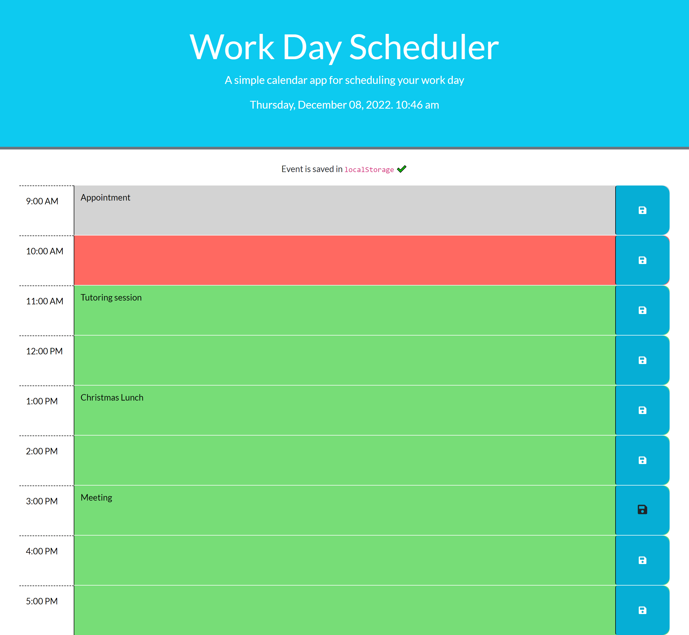

# Project Title:  work-day-scheduler
A simple calendar application that allows a user to save events for each hour of the day. 

## Project Description:
This project presents a simple calendar application that allows a user to save events for each hour of the day. The application colour codes the current, past and future hour slots. It presents the scheduling hours from 9:00 AM to 5:00 PM. Each hour slot can be scheduled seperatly, which gets saved in the local storage.  

This app will run in any browser and feature dynamically updated HTML and a CSS framework (Bootstarp) and is powered by jQuery. It is presented with a clean, polished, and responsive user interface. 

## Credits:
Thanks to Georgeyoo George (https://github.com/Georgeyoo), mfyke matt fyke (https://github.com/mfyke) and cmathena2u Courtney Mathena (https://github.com/cmathena2u) for providing rescources for this project.

## Website URL and Screenshots:

https://veerak21.github.io/work-day-scheduler/

 
Screenshot:

